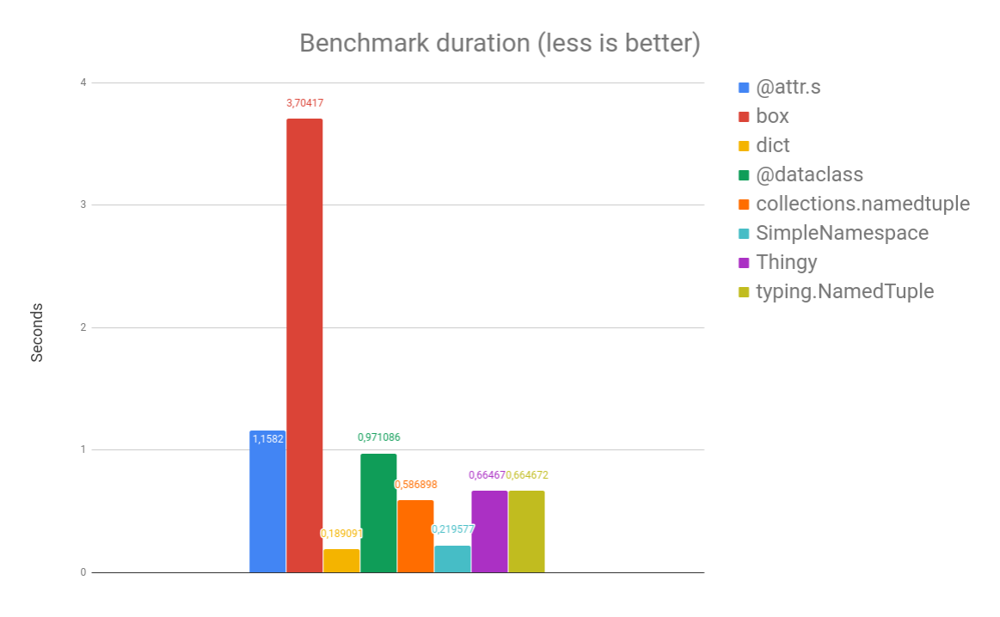

PEP 557 versus the world
========================

This is the micro-benchmark behind my `PEP 557 versus the world
<https://slides.com/ramnes/pep-557>`_ talk. Check out any :code:`with_*.py`
file to see what it does.

Although please note that in the first place, this was more about how to
manipulate the different libraries than check their performance. In no way I
assume that those results are definitive and valid in all use-cases.

Run
---

.. code-block:: sh

   $ git clone https://github.com/ramnes/pep-557-vs-the-world
   $ cd pep557-vs-the-world
   $ virtualenv -ppython3.6 .venv && . .venv/bin/activate
   (.venv) $ pip install -r requirements.txt
   (.venv) $ python run_benchmark.py

Results
-------

